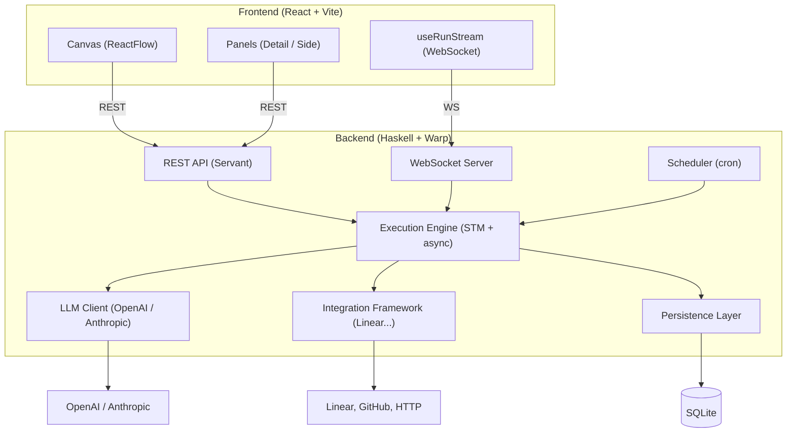

# Eva

Eva is a visual prompt programming IDE. You build **prompt programs** — node graphs that define agent behaviors, integrations, and operational workflows — and run them once or deploy them as ongoing automated processes.

A prompt program is a directed graph of typed primitives: **Triggers** that start a run, **Agents** that call LLMs, **Knowledge** nodes that supply context, **Connectors** that interface with external systems, and **Actions** that transform data. You wire them together on a canvas, configure each node in a side panel, and watch execution stream in real time.

Eva has two modes. **Author mode** is for building: drag nodes from the palette, configure prompts in a Monaco editor, wire ports, and test. **Operate mode** is for monitoring: execution overlays show step states on the canvas, a runs panel lists history, and clicking any node reveals its inputs, outputs, and logs.

## Architecture



The backend is a single Haskell process (Warp + Servant) that serves the REST API, manages WebSocket connections, runs the execution engine, and hosts the in-process cron scheduler. The frontend is a React SPA (Vite) that communicates with the backend over REST for all CRUD operations and WebSocket for streaming execution events.

## Quickstart (Docker)

The fastest way to run Eva locally is with Docker. No Haskell or Node toolchain required.

**Prerequisites:** Docker with Compose (Docker Desktop ≥ 4.x or Docker Engine + the `compose` plugin).

```bash
git clone https://github.com/suzil/eva
cd eva

# Generate a credential master key (required for storing connector secrets)
export EVA_CREDENTIAL_KEY=$(openssl rand -hex 32)

# Optional: add LLM API keys
export EVA_LLM_API_KEY=sk-...           # OpenAI key for GPT models
export EVA_ANTHROPIC_API_KEY=sk-ant-... # Anthropic key for Claude models

# Build and start
docker compose up
```

Open **http://localhost:8080**.

The SQLite database is persisted in a named Docker volume (`eva-data`) and survives container restarts.

> The first `docker compose up` builds the image from scratch — the GHC compile step takes several minutes. Subsequent builds reuse the dependency layer and are much faster.

### Build the image separately

```bash
make docker-build   # docker build -t eva .
make docker-run     # docker compose up
```

## Prerequisites (Development)

| Tool  | Version | Install |
|-------|---------|---------|
| GHC   | 9.10.1  | [ghcup.haskell.org](https://www.haskell.org/ghcup/) |
| cabal | latest  | included with ghcup |
| Node  | 22+     | [nodejs.org](https://nodejs.org) |
| ghcid | latest  | `make install-ghcid` |

## Development Setup

```bash
git clone https://github.com/suzil/eva
cd eva

# Configure environment
cp .env.example .env
# Edit .env — add at minimum LLM_API_KEY and CREDENTIAL_MASTER_KEY (see Configuration below)

# Install frontend dependencies
make install

# Start backend (hot-reload via ghcid on :8080) and frontend (Vite on :5173)
make dev
```

Open **http://localhost:5173**.

> The first `make dev` compiles the Haskell backend, which takes several minutes. Subsequent runs are fast.

## Configuration

Copy `.env.example` to `.env` and fill in the values below. Never commit `.env`.

| Variable | Default | Description |
|----------|---------|-------------|
| `PORT` | `8080` | Backend HTTP port |
| `DB_PATH` | `./eva.db` | SQLite database file path |
| `LLM_API_KEY` | — | OpenAI API key (required for Agent nodes using GPT models) |
| `ANTHROPIC_API_KEY` | — | Anthropic API key (required for Agent nodes using Claude models) |
| `CREDENTIAL_MASTER_KEY` | — | 32-byte hex key for AES-256-GCM credential encryption. Generate with: `openssl rand -hex 32` |
| `LOG_LEVEL` | `info` | Log verbosity: `debug`, `info`, `warn`, or `error` |

At minimum you need `LLM_API_KEY` (or `ANTHROPIC_API_KEY`) to run Agent nodes, and `CREDENTIAL_MASTER_KEY` to store connector credentials.

## Development

### Repo structure

```
eva/
  backend/                  # Haskell (GHC 9.10.1, cabal)
    app/Main.hs             # Entry point — config, AppEnv, Warp server, SIGTERM handler
    src/Eva/
      Core/
        Types.hs            # Program, Node, NodeType, Edge, Port, Message, Run, Step ADTs
        Graph.hs            # Topological sort, readiness check, port compatibility
        Validation.hs       # Program validation (ports wired, configs complete, DAG)
      Engine/
        Runner.hs           # Graph walker — create RunContext, fork steps, propagate messages
        Dispatch.hs         # Pattern-match NodeType → handler
        StateMachine.hs     # Run/Step state transition functions
        Handlers/           # One module per node type (Agent, Action, Trigger, Knowledge, Connector)
        LLM.hs              # Provider abstraction (OpenAI, Anthropic) via http-client
        Scheduler.hs        # In-process cron loop
      Api/
        Server.hs           # Servant API type + all request handlers
        Types.hs            # JSON request/response types
        WebSocket.hs        # Connection manager, topic subscriptions, broadcast
      Integration/
        Types.hs            # Connector typeclass + ActionSpec
        Linear.hs           # Linear API connector
        GitHub.hs           # GitHub API connector
        Http.hs             # Generic REST connector
      Persistence/
        Schema.hs           # persistent model definitions (Template Haskell)
        Queries.hs          # DB query functions
        Migration.hs        # Auto-migration on startup
      Config.hs             # App config loaded from env + YAML
      App.hs                # AppM monad (ReaderT AppEnv IO)
      Crypto.hs             # AES-256-GCM credential encryption
    test/                   # HSpec test suite
  frontend/                 # React + TypeScript (Vite)
    src/
      components/
        nodes/              # Custom ReactFlow nodes (AgentNode, KnowledgeNode, ...)
        edges/              # DataEdge, ResourceEdge
        shell/              # AppShell, ActivityBar, Toolbar, SidePanel, BottomPanel, ...
        detail/             # NodePanel, EdgePanel, StepInspector, per-node config forms
      store/                # canvasStore (Zustand), uiStore (Zustand)
      api/                  # client.ts (fetch), hooks.ts (TanStack Query)
      hooks/                # useRunStream (WebSocket)
      types/                # TypeScript types mirroring backend ADTs
  scripts/
    seed-demo.sh            # Seeds the Weekly Project Summarizer demo program
  Makefile
  .env.example
  .github/workflows/ci.yml
```

### Build and test

```bash
make build      # cabal build (backend) + npm run build (frontend)
make test       # cabal test (backend) + vitest (frontend)
make dev        # ghcid hot-reload (backend) + vite dev server (frontend)
```

### Adding a node type

Adding a new primitive requires changes in both the backend and frontend.

**Backend**

1. [`backend/src/Eva/Core/Types.hs`](backend/src/Eva/Core/Types.hs) — add a variant to the `NodeType` sum type and a corresponding `*Config` record with an `Aeson` instance.
2. [`backend/src/Eva/Engine/Dispatch.hs`](backend/src/Eva/Engine/Dispatch.hs) — add a pattern match in `execute` to route to the new handler.
3. `backend/src/Eva/Engine/Handlers/MyNode.hs` — create the handler; it receives input `Message`s and returns an output `Message`.

**Frontend**

4. [`frontend/src/types/index.ts`](frontend/src/types/index.ts) — add the new type tag and config shape to the `NodeType` discriminated union.
5. `frontend/src/components/nodes/MyNode.tsx` — create a ReactFlow custom node component (extend `BaseNode`).
6. [`frontend/src/components/nodes/index.ts`](frontend/src/components/nodes/index.ts) — register the component in the `nodeTypes` map.
7. `frontend/src/components/detail/forms/MyNodeForm.tsx` — create the configuration form rendered in the Detail Panel.
8. [`frontend/src/components/shell/NodePalette.tsx`](frontend/src/components/shell/NodePalette.tsx) — add the node to the draggable palette.

### Adding a connector

**Backend**

1. `backend/src/Eva/Integration/MyConnector.hs` — implement `availableActions` (returns `[ActionSpec]`) and `executeAction` (dispatches named actions to the external API).
2. [`backend/src/Eva/Engine/Handlers/Connector.hs`](backend/src/Eva/Engine/Handlers/Connector.hs) — register the connector by `system` name so the handler can route to it at runtime.

**Frontend**

3. [`frontend/src/components/detail/forms/ConnectorForm.tsx`](frontend/src/components/detail/forms/ConnectorForm.tsx) — add the system type to the dropdown and any system-specific config fields.

## API Reference

### Programs

| Method | Path | Description |
|--------|------|-------------|
| `GET` | `/api/programs` | List all programs |
| `POST` | `/api/programs` | Create a program |
| `GET` | `/api/programs/:id` | Get a program |
| `PATCH` | `/api/programs/:id` | Update program metadata |
| `DELETE` | `/api/programs/:id` | Delete a program |
| `PUT` | `/api/programs/:id/graph` | Replace the full graph (nodes + edges) |
| `POST` | `/api/programs/:id/validate` | Validate graph without deploying |
| `POST` | `/api/programs/:id/deploy` | Validate + transition Draft → Active |
| `POST` | `/api/programs/:id/pause` | Disable triggers (Active → Paused) |
| `POST` | `/api/programs/:id/resume` | Re-enable triggers (Paused → Active) |

### Execution

| Method | Path | Description |
|--------|------|-------------|
| `POST` | `/api/programs/:id/runs` | Trigger a manual run |
| `GET` | `/api/programs/:id/runs` | List runs for a program |
| `GET` | `/api/runs/:id` | Get a run with its steps |
| `POST` | `/api/runs/:id/cancel` | Cancel an in-progress run |
| `POST` | `/api/runs/:runId/steps/:stepId/resolve` | Resolve a Checkpoint step (approve/reject/modify) |

### Knowledge

| Method | Path | Description |
|--------|------|-------------|
| `GET` | `/api/knowledge` | List knowledge items |
| `POST` | `/api/knowledge` | Create a knowledge item |
| `GET` | `/api/knowledge/:id` | Get a knowledge item |
| `PATCH` | `/api/knowledge/:id` | Update a knowledge item |
| `DELETE` | `/api/knowledge/:id` | Delete a knowledge item |

### Credentials

| Method | Path | Description |
|--------|------|-------------|
| `GET` | `/api/credentials` | List credentials (names only, no secrets) |
| `POST` | `/api/credentials` | Create and encrypt a credential |
| `DELETE` | `/api/credentials/:id` | Delete a credential |

### Webhooks

| Method | Path | Description |
|--------|------|-------------|
| `POST` | `/api/webhooks/:programId/:triggerId` | Fire a webhook trigger |

### WebSocket

Connect to `ws://localhost:8080/api/ws`.

Subscribe to a run's events:

```json
{ "action": "subscribe", "topic": "run:<runId>" }
```

Events emitted on the topic:

| Event type | Payload |
|------------|---------|
| `step_state` | `{ stepId, nodeId, state }` |
| `llm_token` | `{ stepId, token }` |
| `log_entry` | `{ stepId, level, message }` |
| `run_state` | `{ runId, state }` |

## Demo: Weekly Project Summarizer

The included demo program exercises all five MLP node types (Trigger, Knowledge, Connector, Agent, Action), LLM tool use, and streaming output. It reads the active issues from a Linear project and produces a structured weekly progress summary.

**Graph:**

```
[Cron Trigger: Mon 9am] ──event──▶
[Linear Connector] ──tools──▶  [Agent: Summarizer] ──output──▶ [Action: Format Report]
[Knowledge: Team Context] ──context──▶ ↑
```

### Setup

**1. Start Eva**

```bash
make dev
```

**2. Generate a credential master key** (if not already in `.env`)

```bash
openssl rand -hex 32
# Add the output as CREDENTIAL_MASTER_KEY in .env, then restart
```

**3. Add your Linear API key**

Open **http://localhost:5173** → click the **Settings** icon (S) in the Activity Bar → **Add credential** → set System to `linear`, paste your Linear API key, and save.

**4. Seed the demo program**

```bash
make seed
# Or with a custom backend URL:
# make seed BASE_URL=http://localhost:8080
```

This creates the program via the REST API with 5 nodes and 4 edges pre-wired.

**5. Configure the connector**

Open the **Weekly Project Summarizer** program → click the **Linear** connector node → select the credential you added in step 3 → click **Save**.

**6. Run**

Click **Run** in the toolbar. Watch the Agent call the `list_issues` Linear tool, stream tokens in the Output panel, and produce a formatted weekly report. The run appears in the Runs panel when complete.

**7. (Optional) Deploy**

Click **Deploy** to activate the program. It will fire automatically every Monday at 9:00 AM via the built-in cron scheduler and accumulate run history you can browse in Operate mode.

### What it validates

- Authoring: drag 5 nodes, configure, wire, see the Agent's Access Summary update
- One-shot: click Run, watch LLM stream, see Agent call Linear tools
- Operational: Deploy, cron fires on schedule, runs accumulate
- Operate mode: view run history, inspect steps, read output messages
- Credentials: add a Linear API key in Settings, reference it from the Connector node

## Running Tests

```bash
make test
```

This runs the HSpec test suite (`cabal test`) for the backend and the Vitest suite (`npm test`) for the frontend.

## CI

GitHub Actions runs on every push and pull request. See [`.github/workflows/ci.yml`](.github/workflows/ci.yml).

| Job | Environment | Steps |
|-----|-------------|-------|
| `backend` | GHC 9.10.1, Ubuntu | `cabal build all` + `cabal test all` |
| `frontend` | Node 22, Ubuntu | `npm ci` + `npm test` |

Cabal store and `dist-newstyle` are cached by `eva.cabal` hash to keep build times reasonable.
