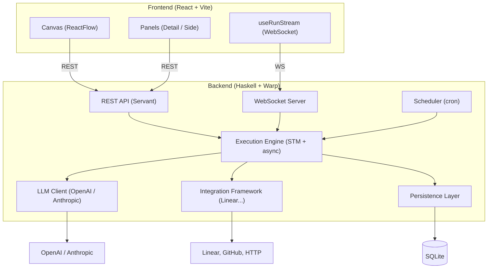

# Eva

Eva is a visual prompt programming IDE. You build **prompt programs** — node graphs that define agent behaviors, integrations, and operational workflows — and run them once or deploy them as ongoing automated processes.

A prompt program is a directed graph of typed primitives: **Triggers** that start a run, **Agents** that call LLMs, **Knowledge** nodes that supply context, **Connectors** that interface with external systems, and **Actions** that transform data. You wire them together on a canvas, configure each node in a side panel, and watch execution stream in real time.

Eva has two modes. **Author mode** is for building: drag nodes from the palette, configure prompts in a Monaco editor, wire ports, and test. **Operate mode** is for monitoring: execution overlays show step states on the canvas, a runs panel lists history, and clicking any node reveals its inputs, outputs, and logs.

**Phase 2** adds six major feature clusters on top of the base IDE: a full Evangelion-inspired visual theme, the MAGI AI assistant (Cmd+K), codebase integration with a Monaco file editor, a bidirectional YAML declarative view, an auto-knowledge system with FTS5 search, and a prompt template library with inline variable bindings.

## Architecture


```mermaid
graph TB
  subgraph frontendLayer ["Frontend (React + Vite)"]
    Canvas["Canvas (ReactFlow)"]
    Panels["Panels (Detail / Side)"]
    WSClient["useRunStream (WebSocket)"]
  end
  subgraph backendLayer ["Backend (Haskell + Warp)"]
    REST["REST API (Servant)"]
    WS["WebSocket Server"]
    Engine["Execution Engine (STM + async)"]
    Scheduler["Scheduler (cron)"]
    LLM["LLM Client (OpenAI / Anthropic)"]
    Integration["Integration Framework (Linear...)"]
    Persistence["Persistence Layer"]
  end
  Canvas -->|REST| REST
  Panels -->|REST| REST
  WSClient -->|WS| WS
  REST --> Engine
  WS --> Engine
  Scheduler --> Engine
  Engine --> LLM
  Engine --> Integration
  Engine --> Persistence
  Persistence --> db[("SQLite")]
  LLM --> ext1["OpenAI / Anthropic"]
  Integration --> ext2["Linear, GitHub, HTTP"]
```

The backend is a single Haskell process (Warp + Servant) that serves the REST API, manages WebSocket connections, runs the execution engine, and hosts the in-process cron scheduler. The frontend is a React SPA (Vite) that communicates with the backend over REST for all CRUD operations and WebSocket for streaming execution events.

## Phase 2 Features

### A. Evangelion Theme

The full UI is restyled with a NERV/EVA aesthetic: a dark terminal palette (`#0a0a0f` background), six custom color scales (terminal, AT-Field amber, eva-green, NERV red, MAGI blue, warn-amber), Rajdhani display font for headers, JetBrains Mono for code, and signature elements including a scanline overlay, hex-grid canvas texture, and NERV caution-stripe accents. All ~30 frontend components are restyled to the new design system.

### B. MAGI AI Assistant

**MAGI** is Eva's built-in AI assistant, accessible via **Cmd+K** (CommandBar overlay) or the assistant tab in the Detail Panel.

Seven capability flows:
- **Generate program** — describe intent in natural language; MAGI proposes a 5-node graph with a preview overlay on the canvas; Accept materializes it
- **Explain** — ask "what does this node do?" or "why did this run fail?"
- **Find** — search across programs, nodes, and knowledge entries
- **Modify** — diff-based targeted edits to existing nodes; `GraphDiffCard` shows added/changed/removed nodes before applying
- **Run ops** — trigger, cancel, or inspect runs via natural language
- **Debug run** — MAGI reads step I/O and log entries and explains failures
- **Improve prompt** — suggests edits to Agent prompts using 6 quality categories

Context is injected automatically (selected node, active run, open program). Use `@` mentions to reference specific nodes, runs, or knowledge entries. Per-program conversation history is persisted.

Backend: `Eva.Assistant` module — `handleAssistantMessage` with a 7-tool LLM loop. WebSocket topic `assistant:<conversationId>`.

### C. Codebase Integration

Connect a local codebase to a program via the **Codebase** activity in the sidebar. Eva scans the directory and presents a file tree.

- **Code tab** — switch to the Code editor tab to browse files in Monaco with the `eva-dark` theme
- **SystemCodebase connector** — wire a Connector node with `system: codebase` to give Agent nodes live file access during a run
- **Staged changesets** — when an Agent proposes code edits, they appear in the **Changes** panel as a diff; accept or reject each file individually

Backend: `Eva.Codebase.{Types,Scanner,Api}` — 15 REST endpoints covering codebase registration, file tree scanning, file read/write, and changeset CRUD.

### D. Declarative View (YAML Spec)

Every program can be viewed and edited as a YAML spec. Switch between **Graph**, **Code**, and **Spec** tabs in the editor tab bar above the canvas.

- Switching Graph → Spec serializes the current graph to Eva YAML format
- Switching Spec → Graph parses the YAML and updates the canvas
- Conflicts (e.g., invalid YAML when switching back) are surfaced via a `SyncWarningModal` with Replace/Keep options

Backend: `Eva.Declarative` — bidirectional HsYAML serialization. REST: `GET /api/programs/:id/spec` and `PUT /api/programs/:id/spec`.

### E. Auto-Knowledge

Eva automatically extracts structured knowledge from connected sources and indexes it with SQLite FTS5 for semantic search.

**Extraction pipelines:**
- **Codebase** — file tree, language stats, dependency graph, per-file LLM summaries
- **Linear** — project structure, workflow states, labels, team members, recent activity

Knowledge is displayed in the **Knowledge Library** panel (accessible from the sidebar). Entries show source, category, freshness, and can be edited or added directly to the canvas as Knowledge nodes.

**Agent integration:** Knowledge entries are injected automatically into Agent context (`category: summary` always; `structure`/`metadata` when a Connector is wired). Agents also have a `search_knowledge` tool for FTS5 keyword search at runtime.

Backend: `Eva.Knowledge.{Types,Store,Extract,Extract.Codebase,Extract.Linear,Query,Api}`. SQLite: `knowledge_entries` table + `knowledge_fts` FTS5 virtual table with 3 sync triggers.

### F. Prompt Assistance

**Template library** — 7 built-in prompt templates (Code Reviewer, Bug Investigator, PR Summarizer, Linear Triage, Data Analyst, Brainstormer, Explainer) plus user-defined templates. Insert a template via the **Template Picker** modal in the Agent config form.

**Variable bindings** — `{{variable}}` placeholders in prompts are automatically detected. The **Variable Binding Panel** lets you bind each variable to a connector output port, a static value, or leave it as a placeholder.

**Inline hints** — `PromptHints` applies 7 rule-based checks (too short, too long, missing JSON schema, unlinked Knowledge, unlinked Connector, anti-patterns, no examples) and surfaces amber banners directly in the Agent config form — no LLM cost.

Backend: `Eva.Prompt.{Types,Store,Resolve,Api}`. The `resolveTemplate` function substitutes `{{variable}}` bindings at run time and generalizes the existing `OpTemplate` Action node.

---

## Quickstart (Docker)

The fastest way to run Eva locally is with Docker. No Haskell or Node toolchain required.

**Prerequisites:** Docker with Compose (Docker Desktop ≥ 4.x or Docker Engine + the `compose` plugin).

```bash
git clone https://github.com/suzil/eva
cd eva

# Generate a credential master key (required for storing connector secrets)
export EVA_CREDENTIAL_KEY=$(openssl rand -hex 32)

# Optional: add LLM API keys
export EVA_LLM_API_KEY=sk-...           # OpenAI key for GPT models
export EVA_ANTHROPIC_API_KEY=sk-ant-... # Anthropic key for Claude models

# Build and start
docker compose up
```

Open **http://localhost:8080**.

The SQLite database is persisted in a named Docker volume (`eva-data`) and survives container restarts.

> The first `docker compose up` builds the image from scratch — the GHC compile step takes several minutes. Subsequent builds reuse the dependency layer and are much faster.

### Build the image separately

```bash
make docker-build   # docker build -t eva .
make docker-run     # docker compose up
```

## Prerequisites (Development)

| Tool  | Version | Install |
|-------|---------|---------|
| GHC   | 9.10.1  | [ghcup.haskell.org](https://www.haskell.org/ghcup/) |
| cabal | latest  | included with ghcup |
| Node  | 22+     | [nodejs.org](https://nodejs.org) |
| ghcid | latest  | `make install-ghcid` |

## Development Setup

```bash
git clone https://github.com/suzil/eva
cd eva

# Configure environment
cp .env.example .env
# Edit .env — add at minimum LLM_API_KEY and CREDENTIAL_MASTER_KEY (see Configuration below)

# Install frontend dependencies
make install

# Start backend (hot-reload via ghcid on :8080) and frontend (Vite on :5173)
make dev
```

Open **http://localhost:5173**.

> The first `make dev` compiles the Haskell backend, which takes several minutes. Subsequent runs are fast.

## Phase 2 Quick-Start

Once Eva is running (via Docker or `make dev`):

### MAGI Assistant

Press **Cmd+K** to open the CommandBar. Type a natural language instruction:

```
"Create a program that reads Linear issues and summarizes them daily"
"Why did this run fail?"
"Add a Knowledge node with our team context to the current program"
```

MAGI proposes a graph, shows a preview overlay on the canvas, and waits for confirmation before making changes. For targeted edits to existing nodes, a diff card shows exactly what will change.

The **Assistant** tab in the Detail Panel provides a persistent per-program conversation thread for longer back-and-forth.

Slash commands: `/explain`, `/find`, `/modify`, `/run`, `/debug`, `/improve`.

### Knowledge Library

1. Click the **Knowledge** icon (book) in the Activity Bar to open the Knowledge Library panel.
2. To connect a codebase: click **+ Codebase**, enter the absolute path to a local repository, and click **Scan**. Eva extracts file structure, language stats, and per-file summaries.
3. To connect Linear: ensure you have a Linear Connector node in your program with a credential set. Eva automatically extracts project structure and recent activity when the program is saved.
4. Entries appear grouped by source with freshness indicators. Click any entry to view or edit it in the Detail Panel. Drag an entry to the canvas to create a Knowledge node from it.

Knowledge is automatically injected as context into Agent nodes. Agents also have a `search_knowledge` tool that fires FTS5 queries at runtime.

### Declarative Spec (YAML view)

Click the **SPEC** tab in the tab bar above the canvas to switch to the YAML editor.

The current graph is serialized to Eva YAML format and displayed in a Monaco editor. Edit the YAML directly, then click the **GRAPH** tab to apply the changes back to the canvas.

If the YAML is invalid when you switch back, a **Replace / Keep** modal gives you the option to discard the YAML edits or keep the graph as-is.

Export a program's YAML for version control:

```bash
curl http://localhost:8080/api/programs/<id>/spec
```

## Configuration

Copy `.env.example` to `.env` and fill in the values below. Never commit `.env`.

| Variable | Default | Description |
|----------|---------|-------------|
| `EVA_PORT` | `8080` | Backend HTTP port |
| `EVA_DB_PATH` | `./eva.db` | SQLite database file path |
| `EVA_LLM_API_KEY` | — | OpenAI API key (required for Agent nodes using GPT models) |
| `EVA_ANTHROPIC_API_KEY` | — | Anthropic API key (required for Agent nodes using Claude models) |
| `EVA_CREDENTIAL_KEY` | — | 32-byte hex key for AES-256-GCM credential encryption. Generate with: `openssl rand -hex 32` |
| `EVA_LOG_LEVEL` | `info` | Log verbosity: `debug`, `info`, `warn`, or `error` |

At minimum you need `EVA_LLM_API_KEY` (or `EVA_ANTHROPIC_API_KEY`) to run Agent nodes, and `EVA_CREDENTIAL_KEY` to store connector credentials.

To load `.env` into a `make dev` session:
```bash
set -a && source .env && set +a && make dev
```

Alternatively, put the values directly in `backend/eva.yaml` — the backend loads it automatically as a fallback.

## Development

### Repo structure

```
eva/
  backend/                  # Haskell (GHC 9.10.1, cabal)
    app/Main.hs             # Entry point — config, AppEnv, Warp server, SIGTERM handler
    src/Eva/
      Core/
        Types.hs            # Program, Node, NodeType, Edge, Port, Message, Run, Step ADTs
        Graph.hs            # Topological sort, readiness check, port compatibility
        Validation.hs       # Program validation (ports wired, configs complete, DAG)
      Engine/
        Runner.hs           # Graph walker — create RunContext, fork steps, propagate messages
        Dispatch.hs         # Pattern-match NodeType → handler
        StateMachine.hs     # Run/Step state transition functions
        Handlers/           # One module per node type (Agent, Action, Trigger, Knowledge, Connector)
        LLM.hs              # Provider abstraction (OpenAI, Anthropic) via http-client
        Scheduler.hs        # In-process cron loop
      Api/
        Server.hs           # Servant API type + all request handlers
        Types.hs            # JSON request/response types
        WebSocket.hs        # Connection manager, topic subscriptions, broadcast (run + assistant topics)
      Integration/
        Types.hs            # Connector typeclass + ActionSpec
        Linear.hs           # Linear API connector
        GitHub.hs           # GitHub API connector (stub)
        Http.hs             # Generic REST connector (stub)
      Persistence/
        Schema.hs           # persistent model definitions (Template Haskell) — 11 tables
        Queries.hs          # DB query functions
        Migration.hs        # Auto-migration on startup
      Codebase/             # P2: codebase integration
        Types.hs            # CodebaseId, FileTree, FileNode, CodeChangeset, CodeFileChange
        Scanner.hs          # Path safety (symlink resolve, no ..), filesystem scan
        Api.hs              # 15 REST endpoints: scan, file read/write, changeset CRUD
      Knowledge/            # P2: auto-knowledge + FTS5
        Types.hs            # KnowledgeEntry, KnowledgeSource, KnowledgeCategory
        Store.hs            # CRUD for knowledge_entries + FTS5 virtual table
        Extract.hs          # Extraction orchestration
        Extract/
          Codebase.hs       # File tree, language stats, per-file summaries
          Linear.hs         # Project structure, workflow, team, activity
        Query.hs            # FTS5 keyword search, structured SQL, combined ranking
        Api.hs              # 8 REST endpoints: list, create, search, refresh, CRUD, reset
      Prompt/               # P2: prompt templates + variable binding
        Types.hs            # PromptTemplate, TemplateVariable, BuiltinTemplate
        Store.hs            # CRUD for prompt_templates + startup seeding of 7 built-ins
        Resolve.hs          # resolveTemplate: {{variable}} substitution at run time
        Api.hs              # 5 REST endpoints: list, create, get, update, delete
      Declarative.hs        # P2: bidirectional YAML ↔ Graph serialization (HsYAML)
      Assistant.hs          # P2: MAGI assistant — handleAssistantMessage, 7 tools, loop
      Config.hs             # App config loaded from env + YAML
      App.hs                # AppM monad (ReaderT AppEnv IO)
      Crypto.hs             # AES-256-GCM credential encryption
    test/                   # HSpec test suite (~150 tests)
  frontend/                 # React + TypeScript (Vite)
    src/
      components/
        nodes/              # Custom ReactFlow nodes (AgentNode, KnowledgeNode, ...)
        edges/              # DataEdge, ResourceEdge
        canvas/             # GraphPreviewOverlay (P2: MAGI graph proposal preview)
        shell/              # AppShell, ActivityBar, Toolbar, SidePanel, BottomPanel,
                            #   EditorTabs (Graph/Code/Spec tab bar), CommandPalette
        detail/             # NodePanel, EdgePanel, StepInspector, per-node config forms,
                            #   PromptHints, VariableBindingPanel, KnowledgeEntryView
        editor/             # CodeEditorView, FileEditor, FileTabBar (P2: Code tab)
                            #   SpecEditorView, SyncWarningModal (P2: Spec tab)
                            #   DiffViewer (P2: agent changeset diffs)
        assistant/          # AssistantPanel, MessageList, MessageBubble, AssistantInput,
                            #   SlashCommandMenu, GraphProposalCard, GraphDiffCard,
                            #   ActionConfirmCard, RunDataCard, NodeReferenceChip,
                            #   TemplatePicker (P2: MAGI assistant)
        panels/             # CodebasePanel, ChangesPanel (P2: codebase)
                            #   KnowledgeLibrary, TemplateLibrary (P2: knowledge + prompts)
      store/                # canvasStore (Zustand), uiStore (Zustand)
      api/                  # client.ts (fetch), hooks.ts, codebase.hooks.ts (TanStack Query)
      hooks/                # useRunStream (WebSocket)
      types/                # TypeScript types mirroring backend ADTs
      monacoSetup.ts        # Monaco theme registration + YAML schema (P2)
      workers/
        yaml.worker.js      # monaco-yaml web worker (P2)
  scripts/
    seed-demo.sh            # Seeds the Weekly Project Summarizer demo program
  Makefile
  .env.example
  .github/workflows/ci.yml
```

### Build and test

```bash
make build      # cabal build (backend) + npm run build (frontend)
make test       # cabal test (backend) + vitest (frontend)
make dev        # ghcid hot-reload (backend) + vite dev server (frontend)
```

### Adding a node type

Adding a new primitive requires changes in both the backend and frontend.

**Backend**

1. [`backend/src/Eva/Core/Types.hs`](backend/src/Eva/Core/Types.hs) — add a variant to the `NodeType` sum type and a corresponding `*Config` record with an `Aeson` instance.
2. [`backend/src/Eva/Engine/Dispatch.hs`](backend/src/Eva/Engine/Dispatch.hs) — add a pattern match in `execute` to route to the new handler.
3. `backend/src/Eva/Engine/Handlers/MyNode.hs` — create the handler; it receives input `Message`s and returns an output `Message`.

**Frontend**

4. [`frontend/src/types/index.ts`](frontend/src/types/index.ts) — add the new type tag and config shape to the `NodeType` discriminated union.
5. `frontend/src/components/nodes/MyNode.tsx` — create a ReactFlow custom node component (extend `BaseNode`).
6. [`frontend/src/components/nodes/index.ts`](frontend/src/components/nodes/index.ts) — register the component in the `nodeTypes` map.
7. `frontend/src/components/detail/forms/MyNodeForm.tsx` — create the configuration form rendered in the Detail Panel.
8. [`frontend/src/components/shell/NodePalette.tsx`](frontend/src/components/shell/NodePalette.tsx) — add the node to the draggable palette.

### Adding a connector

**Backend**

1. `backend/src/Eva/Integration/MyConnector.hs` — implement `availableActions` (returns `[ActionSpec]`) and `executeAction` (dispatches named actions to the external API).
2. [`backend/src/Eva/Engine/Handlers/Connector.hs`](backend/src/Eva/Engine/Handlers/Connector.hs) — register the connector by `system` name so the handler can route to it at runtime.

**Frontend**

3. [`frontend/src/components/detail/forms/ConnectorForm.tsx`](frontend/src/components/detail/forms/ConnectorForm.tsx) — add the system type to the dropdown and any system-specific config fields.

## API Reference

### Programs

| Method | Path | Description |
|--------|------|-------------|
| `GET` | `/api/programs` | List all programs |
| `POST` | `/api/programs` | Create a program |
| `GET` | `/api/programs/:id` | Get a program |
| `PATCH` | `/api/programs/:id` | Update program metadata |
| `DELETE` | `/api/programs/:id` | Delete a program |
| `PUT` | `/api/programs/:id/graph` | Replace the full graph (nodes + edges) |
| `POST` | `/api/programs/:id/validate` | Validate graph without deploying |
| `POST` | `/api/programs/:id/deploy` | Validate + transition Draft → Active |
| `POST` | `/api/programs/:id/pause` | Disable triggers (Active → Paused) |
| `POST` | `/api/programs/:id/resume` | Re-enable triggers (Paused → Active) |

### Execution

| Method | Path | Description |
|--------|------|-------------|
| `POST` | `/api/programs/:id/runs` | Trigger a manual run |
| `GET` | `/api/programs/:id/runs` | List runs for a program |
| `GET` | `/api/runs/:id` | Get a run with its steps |
| `POST` | `/api/runs/:id/cancel` | Cancel an in-progress run |
| `POST` | `/api/runs/:runId/steps/:stepId/resolve` | Resolve a Checkpoint step (approve/reject/modify) |

### Declarative Spec

| Method | Path | Description |
|--------|------|-------------|
| `GET` | `/api/programs/:id/spec` | Serialize program graph to Eva YAML |
| `PUT` | `/api/programs/:id/spec` | Parse YAML and replace the program graph |

### Codebase

| Method | Path | Description |
|--------|------|-------------|
| `GET` | `/api/codebases` | List codebases |
| `POST` | `/api/codebases` | Register a codebase path |
| `GET` | `/api/codebases/:id` | Get a codebase |
| `DELETE` | `/api/codebases/:id` | Delete a codebase |
| `POST` | `/api/codebases/:id/scan` | Scan directory and return `FileTree` |
| `GET` | `/api/codebases/:id/files?path=...` | Read a file's content |
| `GET` | `/api/codebases/:id/changesets` | List changesets |
| `POST` | `/api/codebases/:id/changesets` | Create a changeset |
| `GET` | `/api/codebases/:id/changesets/:csId` | Get a changeset |
| `PATCH` | `/api/codebases/:id/changesets/:csId` | Update changeset metadata |
| `DELETE` | `/api/codebases/:id/changesets/:csId` | Delete a changeset |
| `GET` | `/api/codebases/:id/changesets/:csId/files/:fileId` | Get a file change |
| `POST` | `/api/codebases/:id/changesets/:csId/files/:fileId/accept` | Accept a file change |
| `POST` | `/api/codebases/:id/changesets/:csId/files/:fileId/reject` | Reject a file change |

### Knowledge

| Method | Path | Description |
|--------|------|-------------|
| `GET` | `/api/programs/:id/knowledge` | List knowledge entries for a program |
| `POST` | `/api/programs/:id/knowledge` | Create a knowledge entry |
| `POST` | `/api/programs/:id/knowledge/search` | FTS5 keyword search across entries |
| `POST` | `/api/programs/:id/knowledge/refresh` | Re-extract from connected sources |
| `GET` | `/api/knowledge/:entryId` | Get a knowledge entry |
| `PATCH` | `/api/knowledge/:entryId` | Edit a knowledge entry |
| `DELETE` | `/api/knowledge/:entryId` | Delete a knowledge entry |
| `POST` | `/api/knowledge/:entryId/reset` | Reset an edited entry to its extracted content |

### Templates

| Method | Path | Description |
|--------|------|-------------|
| `GET` | `/api/templates` | List all templates (built-in + user) |
| `POST` | `/api/templates` | Create a user template |
| `GET` | `/api/templates/:id` | Get a template |
| `PATCH` | `/api/templates/:id` | Update a user template (built-ins are read-only) |
| `DELETE` | `/api/templates/:id` | Delete a user template |

### Credentials

| Method | Path | Description |
|--------|------|-------------|
| `GET` | `/api/credentials` | List credentials (names only, no secrets) |
| `POST` | `/api/credentials` | Create and encrypt a credential |
| `DELETE` | `/api/credentials/:id` | Delete a credential |

### Webhooks

| Method | Path | Description |
|--------|------|-------------|
| `POST` | `/api/webhooks/:programId/:triggerId` | Fire a webhook trigger |

### WebSocket

Connect to `ws://localhost:8080/api/ws`.

Subscribe to a run's events:

```json
{ "action": "subscribe", "topic": "run:<runId>" }
```

Events emitted on the topic:

| Event type | Payload |
|------------|---------|
| `step_state` | `{ stepId, nodeId, state }` |
| `llm_token` | `{ stepId, token }` |
| `log_entry` | `{ stepId, level, message }` |
| `run_state` | `{ runId, state }` |
| `tool_call` | `{ nodeId, phase: "invoke"\|"result", data }` |

Subscribe to a MAGI assistant conversation:

```json
{ "action": "subscribe", "topic": "assistant:<conversationId>" }
```

Send a message to MAGI (on the same connection):

```json
{ "action": "assistant_message", "content": "Why did this run fail?", "context": { "runId": "..." } }
```

Events emitted on the assistant topic:

| Event type | Payload |
|------------|---------|
| `assistant_token` | `{ conversationId, token }` — streaming token |
| `assistant_reply` | `{ conversationId, message }` — final reply with full `AssistantMessage` |

## Demo: Weekly Project Summarizer

The included demo program exercises all five MLP node types (Trigger, Knowledge, Connector, Agent, Action), LLM tool use, and streaming output. It reads the active issues from a Linear project and produces a structured weekly progress summary.

**Graph:**

```
[Cron Trigger: Mon 9am] ──event──▶
[Linear Connector] ──tools──▶  [Agent: Summarizer] ──output──▶ [Action: Format Report]
[Knowledge: Team Context] ──context──▶ ↑
```

### Setup

**1. Start Eva**

```bash
make dev
```

**2. Generate a credential master key** (if not already in `.env`)

```bash
openssl rand -hex 32
# Add the output as CREDENTIAL_MASTER_KEY in .env, then restart
```

**3. Add your Linear API key**

Open **http://localhost:5173** → click the **Settings** icon (S) in the Activity Bar → **Add credential** → set System to `linear`, paste your Linear API key, and save.

**4. Seed the demo program**

```bash
make seed
# Or with a custom backend URL:
# make seed BASE_URL=http://localhost:8080
```

This creates the program via the REST API with 5 nodes and 4 edges pre-wired.

**5. Configure the connector**

Open the **Weekly Project Summarizer** program → click the **Linear** connector node → select the credential you added in step 3 → click **Save**.

**6. Run**

Click **Run** in the toolbar. Watch the Agent call the `list_issues` Linear tool, stream tokens in the Output panel, and produce a formatted weekly report. The run appears in the Runs panel when complete.

**7. (Optional) Deploy**

Click **Deploy** to activate the program. It will fire automatically every Monday at 9:00 AM via the built-in cron scheduler and accumulate run history you can browse in Operate mode.

### What it validates

- Authoring: drag 5 nodes, configure, wire, see the Agent's Access Summary update
- One-shot: click Run, watch LLM stream, see Agent call Linear tools
- Operational: Deploy, cron fires on schedule, runs accumulate
- Operate mode: view run history, inspect steps, read output messages
- Credentials: add a Linear API key in Settings, reference it from the Connector node

## Demo: The NERV Interface (Phase 2)

The Phase 2 end-to-end demo exercises all six feature clusters in a single walkthrough using the Weekly Project Summarizer program.

**1. EVA aesthetic** — The app loads with the NERV-style canvas, Rajdhani display headers, hex-grid texture, and scanline overlay.

**2. Generate with MAGI** — Press **Cmd+K**, type `"Create a weekly Linear summarizer"`. MAGI proposes a 5-node graph (Cron Trigger → Linear Connector → Agent → Action, with a Knowledge node wired for context). A preview overlay highlights the proposed nodes on the canvas. Click **Accept** to materialize them.

**3. Knowledge Library** — Open the Knowledge activity, click **+ Codebase**, point it at the `eva/` repo. After scanning, you see entries for file structure, language distribution, and key module summaries. Drag the "Project Overview" entry to the canvas to wire it as the Agent's Knowledge node.

**4. Spec tab** — Click the **SPEC** tab. The Weekly Summarizer program serializes to readable YAML. Edit the cron schedule from `"0 9 * * 1"` to `"0 8 * * 1"`. Switch back to **GRAPH** — the Trigger node reflects the updated schedule.

**5. Prompt template** — Click the Agent node → open config form → click **Insert Template** → select "Linear Triage". The `{{project}}` and `{{issues}}` variables appear in the Variable Binding Panel. Bind `{{issues}}` to the Linear Connector's output port.

**6. Inline hint** — Save the program without wiring the Knowledge node to the Agent. A warn-amber **PromptHint** banner appears: "Unlinked Knowledge node detected — context will not be injected." Wire the Knowledge node to clear it.

**7. Code tab** — Click the **CODE** tab, open the Codebase panel, navigate to `backend/src/Eva/Engine/Handlers/Agent.hs` and browse it in Monaco with `eva-dark` theme.

**8. Run** — Click **Run**. Watch MAGI stream tokens in the Output panel while the Linear `list_issues` tool call fires. The completed run appears in the Runs panel with the full structured summary.

**9. Spec export** — `curl http://localhost:8080/api/programs/<id>/spec > weekly-summarizer.yaml` — the full program as version-controllable YAML.

## Running Tests

```bash
make test
```

This runs the HSpec test suite (`cabal test`, ~150 tests across 17 modules) for the backend and the Vitest suite (`npm test`, ~50 tests across 10 files) for the frontend.

## CI

GitHub Actions runs on every push and pull request. See [`.github/workflows/ci.yml`](.github/workflows/ci.yml).

| Job | Environment | Steps |
|-----|-------------|-------|
| `backend` | GHC 9.10.1, Ubuntu | `cabal build all` + `cabal test all` |
| `frontend` | Node 22, Ubuntu | `npm ci` + `npm test` |

Cabal store and `dist-newstyle` are cached by `eva.cabal` hash to keep build times reasonable.
